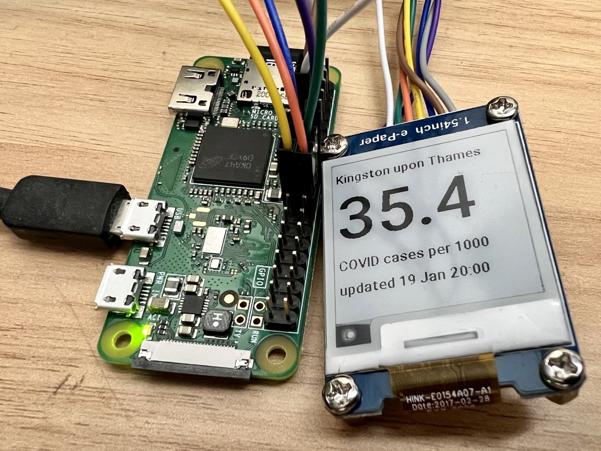

# **Scaredi-Pi**: The **S**imple **C**OVID **A**mbient **R**eporting **E**-ink **DI**splay for **Pi**

---

*Credit:* [original code](https://github.com/annapowellsmith/scaredi-pi) by Anna Powell Smith (I was inspired by [this original Tweet](https://twitter.com/darkgreener/status/1331359454709895171))

---

Script to obtain the latest normalised confirmed COVID-19 case numbers in a UK local authority,
and display then on an e-paper screen powered by a Raspberry Pi. Run this as a cron job to
update the numbers as often as you like.

This is running on a Raspberry Pi Zero W with Bullseye Raspberry Pi OS, and [1.54 inch V2 Waveshare EPD](https://www.waveshare.com/wiki/1.54inch_e-Paper_Module). I'm running via an hourly cron job.

Case numbers are obtained from [the official UK coronavirus dashboard API](https://coronavirus.data.gov.uk/details/developers-guide) then multiplied by an estimate for the actual prevalence in the population, to reach an estimate of the approximate real case rate.

## Usage

- Attach the screen to the Pi via [the pins described on the Hardware/Software setup tab on the Waveshare wiki](https://www.waveshare.com/wiki/1.54inch_e-Paper_Module)
- Enable the SPI interface using `raspi-config`.
- Install requirements and the [waveshare_epd Python library](https://github.com/waveshare/e-Paper)
  (the latter can't be installed by pip because of the ampersand in the filepath).
- Add a TTF font file of your choice to the `assets` directory
- Update the constants in the script for your chosen font and local authority
- Update the `waveshare_epd` import and drawing commands as needed for your own e-paper screen
